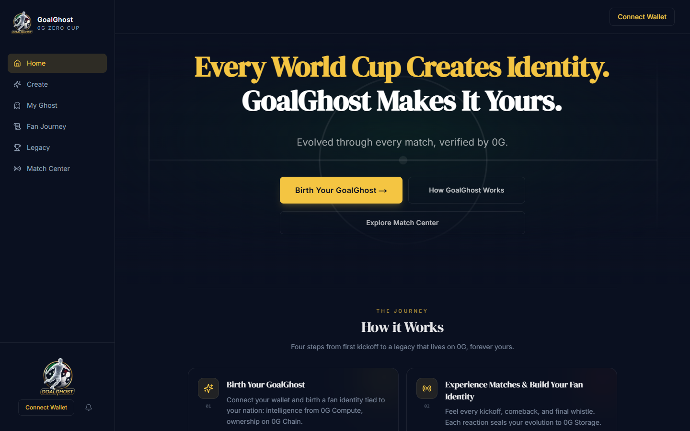
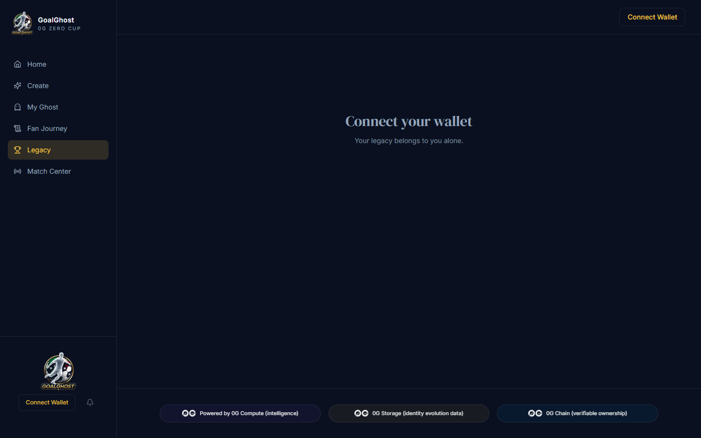
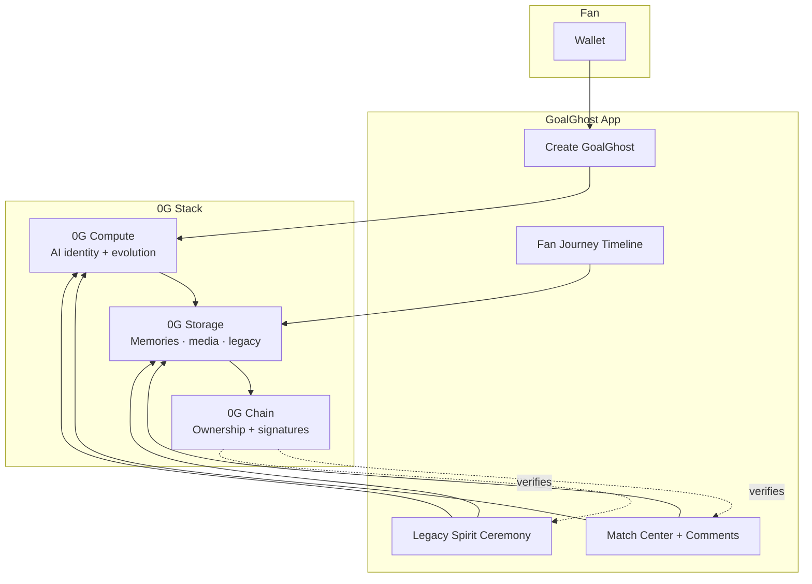

<p align="center">
  
</p>

<h1 align="center">GoalGhost</h1>

<p align="center">
  <strong>A living AI football identity built on 0G.</strong><br />
  Not a profile. Not an NFT.<br />
  A fan identity that thinks, evolves, remembers, and leaves an onchain legacy.
</p>

<p align="center">
  <a href="https://goalghost.vercel.app"><strong>Live Demo</strong></a>
  &nbsp;·&nbsp;
  <a href="https://github.com/ScavenGem/GoalGhost">GitHub</a>
  &nbsp;·&nbsp;
  Built for the <strong>0G Zero Cup</strong>
</p>

---

## Watch GoalGhost in Action

> **Visual asset:** Add a 15–30s demo GIF or MP4 here (Create → Seal → Match Center → Legacy ceremony).  
> Suggested path: `docs/demo/goalghost-demo.gif`

<!--
<p align="center">
  
</p>
-->

<p align="center">
  <em>Replace the comment block above with your demo asset when ready.</em>
</p>

---

## The Problem

Football fans generate millions of reactions, comments, and emotions during every tournament.

Yet all of it disappears the moment the final whistle blows.

Current platforms only store likes and statistics.  
None preserve a fan's **evolving identity**.

When the tournament ends, your story ends too.

---

## Our Solution

**GoalGhost** creates a persistent, living AI football identity that evolves with you throughout the World Cup.

Every reaction, comment, and moment becomes part of your permanent fan history.

### Powered by 0G

| Layer | Role |
|-------|------|
| **0G Compute** | Generates and evolves your AI fan personality in real time |
| **0G Storage** | Permanently stores identity memories, evolution history, and signed media |
| **0G Chain** | Verifies ownership, wallet signatures, and identity actions |

Instead of owning collectibles…  
**You own a living football identity.**

<p align="center">
  
</p>

---

## User Journey

| Step | What happens |
|------|----------------|
| **1. Connect Wallet** | Connect your 0G wallet. Ownership starts on Chain. |
| **2. Birth Your GoalGhost** | Choose your nation, personality, and fan traits. 0G Compute generates your unique football identity. |
| **3. Seal Identity** | Your ghost is permanently sealed on 0G Storage. Ownership is verified on 0G Chain. |
| **4. Match Center** | Read live football news, leave wallet-signed comments, upload images, and react to other fans. Every action becomes part of your identity evolution. |
| **5. Fan Journey** | Watch your GoalGhost evolve over time based on your interactions. |
| **6. Legacy** | At the end of the tournament, receive your personal football Wrapped: a cinematic, emotional summary of your journey, permanently stored on 0G. |

---

## Product Screenshots

> **Visual assets:** Capture full-page screenshots at `1440×900` and place under `docs/screenshots/`.

| Page | Route | Suggested file |
|------|-------|----------------|
| Home | `/` | `docs/screenshots/home.png` |
| Create | `/create` | `docs/screenshots/create.png` |
| Match Center | `/matches` | `docs/screenshots/match-center.png` |
| Fan Journey | `/memories` | `docs/screenshots/fan-journey.png` |
| Legacy | `/legacy` | `docs/screenshots/legacy.png` |

<!--
<p align="center">
  
  
</p>
-->

---

## Why 0G Is Irreplaceable

| Without 0G Compute | Without 0G Storage | Without 0G Chain |
|--------------------|--------------------|------------------|
| No living AI identity | No permanent fan memories | No verifiable ownership |
| Static profiles, no match feelings | Centralized cache that forgets | Anyone could fake your story |
| No evolution or Legacy narrative | Comments and media vanish | No wallet-signed proof |

GoalGhost only exists because these three components work together.

Every major surface displays **"0G does irreplaceable work here"** with Compute, Storage, and Chain badges on Home, Create, My Ghost, Fan Journey, and Legacy.

---

## Architecture



**Linear flow (judge view):**

```
Wallet
  │
  ▼
Create GoalGhost
  │
  ▼
0G Compute  →  Generate fan identity, reactions, evolution, Legacy narrative
  │
  ▼
0G Storage  →  Store memories, comments, images, evolution, Legacy documents
  │
  ▼
0G Chain    →  Ownership, wallet signatures, verification
```

| Concern | Implementation |
|---------|----------------|
| Compute routes | `POST /api/compute/create-ghost`, `match-reaction`, `evolve`, `legacy` |
| Storage uploads | Browser ECIES seal + server public uploads for signed comments |
| Chain | Wallet connect, Agentic ID mint, milestone anchoring on Aristotle mainnet |
| Index cache | Neon Postgres indexes `rootHash` only; Storage remains source of truth |

---

## Features

- Wallet authentication (RainbowKit + Wagmi)
- AI identity generation via **0G Compute**
- Identity evolution from match reactions and social activity
- **Match Center** with live World Cup news
- Wallet-signed comments (News + Legacy walls)
- Image and GIF attachments on comments
- **Fan Journey** chronological timeline with Storage verification links
- **Cinematic Legacy Wrapped** (full-screen Spirit ceremony, share, download)
- End-to-end **0G Compute + Storage + Chain** integration

---

## Tech Stack

| Category | Tools |
|----------|-------|
| Frontend | Next.js 15, TypeScript, React, Tailwind CSS v4, Framer Motion |
| Wallet | RainbowKit, Wagmi, ethers.js, viem |
| Data | Prisma, Neon PostgreSQL (index cache) |
| 0G | Compute TS SDK, Storage TS SDK, Aristotle mainnet (16661) |
| Deploy | Vercel |

---

## Demo Flow

1. **Connect Wallet**
2. **Create GoalGhost** (nation + personality)
3. **Generate Identity** using 0G Compute
4. **Seal Identity** to 0G Storage
5. **Sign Comments** and upload images in Match Center / Legacy
6. **Watch Identity Evolve** on My Ghost and Fan Journey
7. **Generate Legacy Wrapped** (cinematic Spirit ceremony)

**Live:** [goalghost.vercel.app](https://goalghost.vercel.app)

---

## Why It Matters

GoalGhost turns football fandom into a **persistent digital identity**.

Instead of remembering the tournament…  
**The tournament remembers you.**

---

## For Judges

### How 0G is used

| Primitive | Irreplaceable work in GoalGhost |
|-----------|----------------------------------|
| **0G Compute** | Powers real-time AI identity generation, match reactions, evolution narratives, and Legacy storytelling |
| **0G Storage** | Permanently stores profiles, memories, signed comments, media, and Legacy documents (content-addressed) |
| **0G Chain** | Handles wallet signatures, ownership verification, and on-chain identity actions |

Without any of these three layers, GoalGhost would not be possible.

### What to verify

1. **Compute** · Call `/api/compute/*` with `OG_COMPUTE_MODE=live` (or labeled fallback when offline)
2. **Storage** · Complete Create → copy `rootHash` → confirm on [storagescan.0g.ai](https://storagescan.0g.ai)
3. **Chain** · Wallet-owned Agentic ID + signed comment payloads
4. **Resilience** · Postgres is a cache; drop the DB and ghost data still resolves from Storage roots

### Network (0G Aristotle Mainnet)

| Setting | Value |
|---------|-------|
| Chain ID | `16661` |
| RPC | `https://evmrpc.0g.ai` |
| Storage Indexer | `https://indexer-storage-turbo.0g.ai` |
| Explorer | [storagescan.0g.ai](https://storagescan.0g.ai) |

---

## Quick Start (Developers)

```bash
git clone https://github.com/ScavenGem/GoalGhost.git
cd GoalGhost
npm install
cp .env.example .env.local
npx prisma db push
npm run build
npm run dev
```

Open **http://localhost:3000**

### Key environment variables

| Variable | Purpose |
|----------|---------|
| `NEXT_PUBLIC_WALLETCONNECT_PROJECT_ID` | RainbowKit |
| `DATABASE_URL` | Neon Postgres (index cache) |
| `OG_COMPUTE_MODE` | `mock` or `live` |
| `OG_COMPUTE_PRIVATE_KEY` | Live compute (server) |
| `OG_STORAGE_PRIVATE_KEY` | Server-side public uploads |
| `FOOTBALL_DATA_API_KEY` | Live match data (optional) |
| `NEXT_PUBLIC_NEWS_API_KEY` | World Cup news feed (optional) |

```bash
npm run build   # production verify
npm run dev     # local development
```

---

<p align="center">
  <strong>GoalGhost</strong> · Every World Cup creates identity. GoalGhost makes it yours.<br />
  <sub>Built for the 0G Zero Cup · June 2026</sub>
</p>