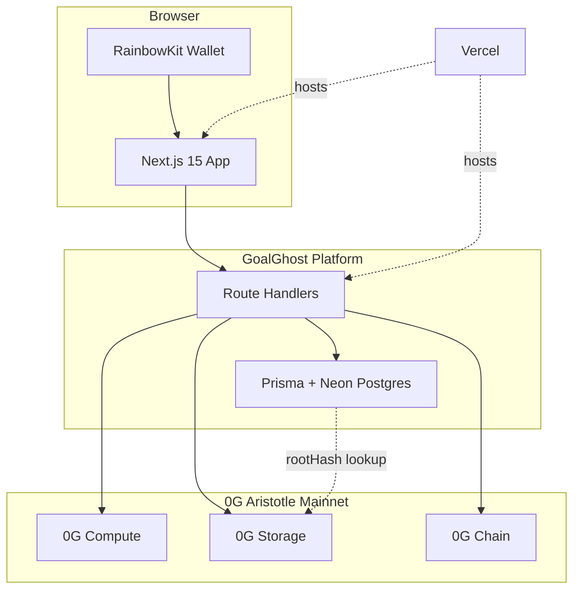

<div align="center">


# GoalGhost

**A living AI football identity platform built on 0G.**

Evolving fan identities · Permanent fan journey records · Spotify Wrapped-style football legacy

[](https://goalghost.vercel.app)
[](https://github.com/ScavenGem/GoalGhost)
[](https://github.com/ScavenGem/GoalGhost/releases/tag/v1.0.0)

**[Live App](https://goalghost.vercel.app)** · **[GitHub](https://github.com/ScavenGem/GoalGhost)** · **[Judge Walkthrough](#judge-walkthrough)** · **0G Zero Cup Submission**

<br />


<sub>Last verified: <strong>June 24, 2026</strong> · Production: <a href="https://goalghost.vercel.app">goalghost.vercel.app</a></sub>

</div>

---

## Contents

| Section | Link |
| --- | --- |
| Overview | [#overview](#overview) |
| Final Working Status | [#final-working-status](#final-working-status) |
| Why 0G Stack | [#why-goalghost-needs-the-full-0g-stack](#why-goalghost-needs-the-full-0g-stack) |
| Technical Highlights | [#technical-highlights](#technical-highlights) |
| Architecture | [#architecture](#architecture) |
| Judge Walkthrough | [#judge-walkthrough](#judge-walkthrough) |
| Features | [#features](#features) |
| Screenshots | [#screenshots](#screenshots) |
| Tech Stack | [#tech-stack](#tech-stack) |
| Quick Start | [#quick-start](#quick-start) |

---

## Overview

**GoalGhost** turns World Cup fandom into a **persistent, evolving AI football identity**.

Fans connect a wallet, birth a GoalGhost, react across the tournament, and close with a **cinematic Legacy Wrapped**: an emotional, shareable summary of their fan journey. Every identity, evolution chapter, comment, and legacy document is anchored to the **full 0G stack**.

| Layer | Role in GoalGhost |
| --- | --- |
| **0G Compute** | AI identity generation, match reactions, evolution narratives, Legacy storytelling |
| **0G Storage** | Encrypted profiles, fan journey records, signed comments, media, Legacy documents |
| **0G Chain** | Wallet signatures, Agentic ID ownership, verifiable identity actions |

Neon PostgreSQL indexes content by `rootHash` for fast reads. **0G Storage remains the source of truth.**

---

## Final Working Status

Verified on production (**June 24, 2026**).

| Feature | Status |
| --- | --- |
| Wallet connect | ✅ Working |
| GoalGhost creation | ✅ Working |
| Wallet signing | ✅ Working |
| Seal to 0G Storage | ✅ Working |
| Evolution stories | ✅ Working |
| Match Center reactions | ✅ Working |
| News comments | ✅ Working |
| Legacy unwrap | ✅ Working |
| Legacy comments | ✅ Working |
| Production deployed on Vercel | ✅ Working |

---

## Why GoalGhost Needs the Full 0G Stack

Football platforms capture likes and stats. They do not preserve a fan's **evolving identity** across a tournament.

| Without 0G Compute | Without 0G Storage | Without 0G Chain |
| --- | --- | --- |
| No living AI identity | No permanent fan journey | No verifiable ownership |
| No match reactions or evolution | Comments and media vanish on refresh | Anyone could fake a fan story |
| No Legacy narrative | Centralized cache that forgets | No wallet-signed proof |

Remove any one layer and the core experience breaks. Key surfaces display **"0G does irreplaceable work here"** with Compute, Storage, and Chain badges.

---

## Technical Highlights

| Area | Implementation |
| --- | --- |
| AI identity generation | `POST /api/compute/create-ghost` — name, traits, mood, conviction |
| Permanent storage | Browser ECIES seal for profiles; content-addressed roots on 0G Storage |
| Wallet-signed interactions | News and Legacy comments signed by the connected wallet before upload |
| Evolution engine | Match reactions and emoji activity update mood, confidence, and Fan Journey |
| Legacy generation | `POST /api/compute/legacy` — Wrapped-style narrative with cinematic Spirit ceremony |

---

## Architecture



| Component | Role |
| --- | --- |
| **Wallet** | RainbowKit + Wagmi on 0G Aristotle (chain `16661`); signs comments and mints Agentic ID |
| **0G Compute** | Live inference when `OG_COMPUTE_MODE=live`; powers create, match-reaction, evolve, legacy |
| **0G Storage** | ECIES-encrypted profiles from wallet; public uploads for signed social content |
| **0G Chain** | `iMint` on Agentic ID contract; storage roots anchored to wallet-owned identity |
| **Neon** | Postgres index cache — not the canonical data store |
| **Vercel** | Production hosting at [goalghost.vercel.app](https://goalghost.vercel.app) |

**Compute routes**

| Method | Route |
| --- | --- |
| POST | `/api/compute/create-ghost` |
| POST | `/api/compute/match-reaction` |
| POST | `/api/compute/evolve` |
| POST | `/api/compute/legacy` |

---

## Judge Walkthrough

> **Demo video:** No separate YouTube upload. Use the **[live app](https://goalghost.vercel.app)** and follow the steps below (~5 minutes).

| Step | Action | Route | Verify |
| --- | --- | --- | --- |
| 1 | Connect wallet | Any page | RainbowKit on 0G Aristotle mainnet |
| 2 | Create GoalGhost | `/create` | Nation + personality selection |
| 3 | Generate with 0G Compute | `/create` | AI name, traits, mood, conviction |
| 4 | Sign profile | `/create` | Wallet signs ECIES seal payload |
| 5 | Seal to 0G Storage | `/create` | `rootHash` on [storagescan.0g.ai](https://storagescan.0g.ai) |
| 6 | Mint on 0G Chain | `/create` | Agentic ID minted; token linked to storage root |
| 7 | Fan Journey | `/memories` | Evolution timeline with Storage links |
| 8 | My Ghost | `/ghost` | Evolution score, mood, Evolve Narrative |
| 9 | Match Center | `/matches` | Live feed, emoji reactions, Compute reactions |
| 10 | News comments | `/` | Wallet-signed comments with image/GIF attachments |
| 11 | Legacy unwrap | `/legacy` | Cinematic Spirit ceremony: share, seal, download, replay |
| 12 | Legacy comments | `/legacy` | Wallet-signed public comments wall |

**Resilience check:** Postgres is a cache. Profiles resolve from 0G Storage `rootHash` even if the index is rebuilt.

### 0G Aristotle Mainnet

| Setting | Value |
| --- | --- |
| Chain ID | `16661` |
| RPC | `https://evmrpc.0g.ai` |
| Chain explorer | [chainscan.0g.ai](https://chainscan.0g.ai) |
| Storage indexer | `https://indexer-storage-turbo.0g.ai` |
| Storage explorer | [storagescan.0g.ai](https://storagescan.0g.ai) |

---

## Features

Only shipped, working capabilities are listed here.

| Feature | Description |
| --- | --- |
| Wallet authentication | RainbowKit + Wagmi on 0G Aristotle mainnet |
| GoalGhost creation | Nation, personality, birth ritual, AI-generated identity |
| 0G Compute | Create, match reactions, evolution stories, Legacy generation |
| 0G Storage | ECIES profile seal, fan journey records, signed comments, Legacy documents |
| 0G Chain | Agentic ID `iMint`, wallet-signed comment payloads |
| My Ghost | Live stats, evolution arc, on-demand narrative evolution |
| Match Center | Live/upcoming/finished matches, emoji reactions, Compute reactions |
| World Cup news | Headlines on Home with wallet-signed comments and media |
| Fan Journey | Evolution timeline with Storage verification links |
| Legacy Wrapped | Cinematic Spirit ceremony with share, seal, download, replay |
| Legacy comments | Wallet-signed public wall on `/legacy` |
| 0G banners | Compute / Storage / Chain callouts on key surfaces |

---

## Screenshots

Production captures at `1440×900`. Regenerate with:

```bash
node scripts/capture-readme-screenshots.mjs
```

<p align="center">
  
  
</p>

<p align="center">
  
  
</p>

<p align="center">
  
  
</p>

| Page | Route | File |
| --- | --- | --- |
| Home | `/` | `docs/screenshots/home.png` |
| Create | `/create` | `docs/screenshots/create.png` |
| My Ghost | `/ghost` | `docs/screenshots/my-ghost.png` |
| Match Center | `/matches` | `docs/screenshots/match-center.png` |
| Fan Journey | `/memories` | `docs/screenshots/fan-journey.png` |
| Legacy | `/legacy` | `docs/screenshots/legacy.png` |

---

## Tech Stack

| Category | Technology |
| --- | --- |
| Framework | Next.js 15 (App Router), TypeScript, React 19 |
| UI | Tailwind CSS v4, Framer Motion, Radix UI |
| Wallet | RainbowKit, Wagmi, ethers.js, viem |
| Database | Prisma + Neon PostgreSQL (index cache) |
| 0G | `@0gfoundation/0g-compute-ts-sdk`, `@0gfoundation/0g-storage-ts-sdk` |
| Chain | 0G Aristotle mainnet (`16661`) |
| Deploy | Vercel |

---

## Quick Start

```bash
git clone https://github.com/ScavenGem/GoalGhost.git
cd GoalGhost
npm install
cp .env.example .env.local
npx prisma db push
npm run build
npm run dev
```

Open **http://localhost:3000**

### Key environment variables

| Variable | Purpose |
| --- | --- |
| `NEXT_PUBLIC_WALLETCONNECT_PROJECT_ID` | RainbowKit wallet modal |
| `DATABASE_URL` / `DIRECT_URL` | Neon Postgres index cache |
| `OG_COMPUTE_MODE` | Set to `live` for real 0G Compute inference |
| `OG_COMPUTE_PRIVATE_KEY` | Server compute wallet (live mode) |
| `OG_STORAGE_PRIVATE_KEY` | Server uploads for signed comment media |
| `NEXT_PUBLIC_AGENTIC_ID_CONTRACT` | Deployed Agentic ID contract address |
| `NEXT_PUBLIC_NEWS_API_KEY` | World Cup news feed (optional) |
| `FOOTBALL_DATA_API_KEY` / `API_FOOTBALL_KEY` | Live match data (optional) |

```bash
npm run build        # production verify
npm run dev          # local development
npm run compute:init # initialize 0G Compute ledger (live mode)
```

See [CHANGELOG.md](CHANGELOG.md) for release history · [v1.0.0 Release](https://github.com/ScavenGem/GoalGhost/releases/tag/v1.0.0)

---

<div align="center">


**GoalGhost** · The tournament remembers you.

<sub>0G Zero Cup · June 2026 · <a href="https://goalghost.vercel.app">goalghost.vercel.app</a></sub>

</div>