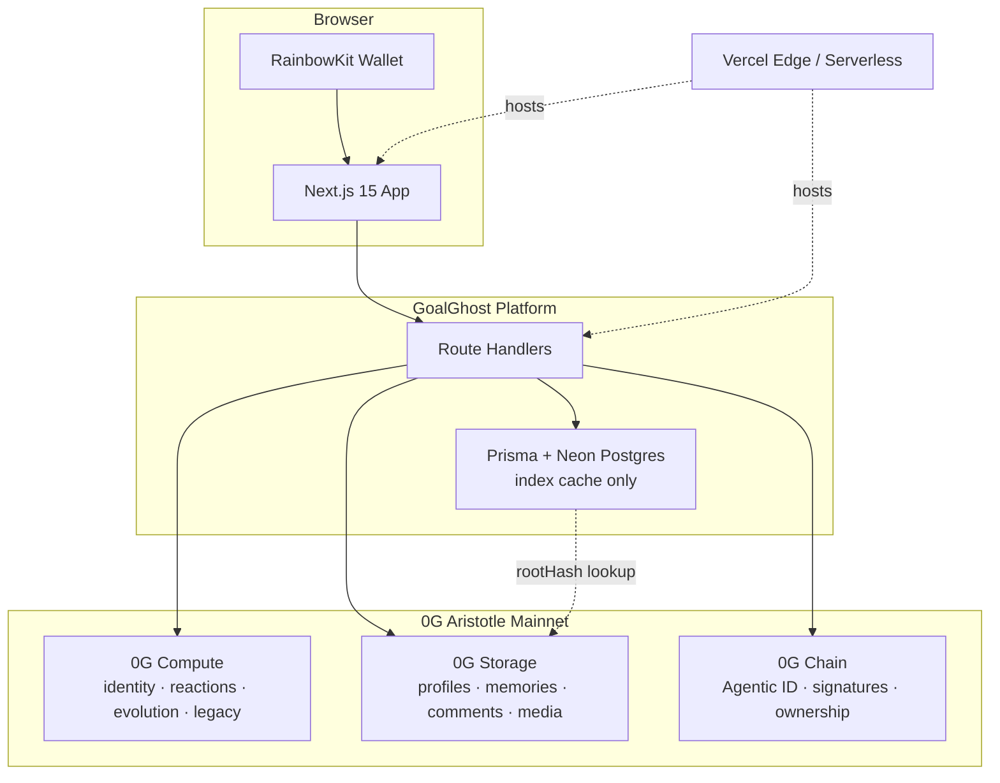
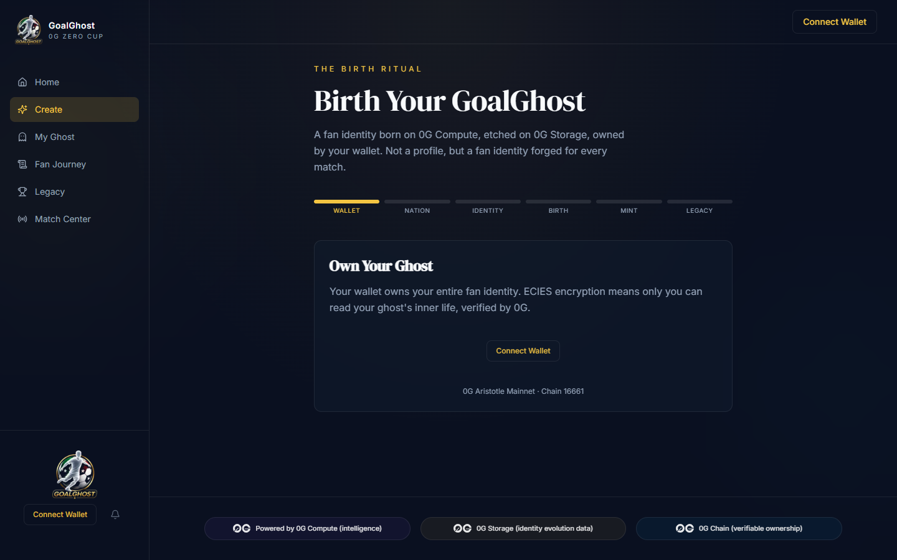
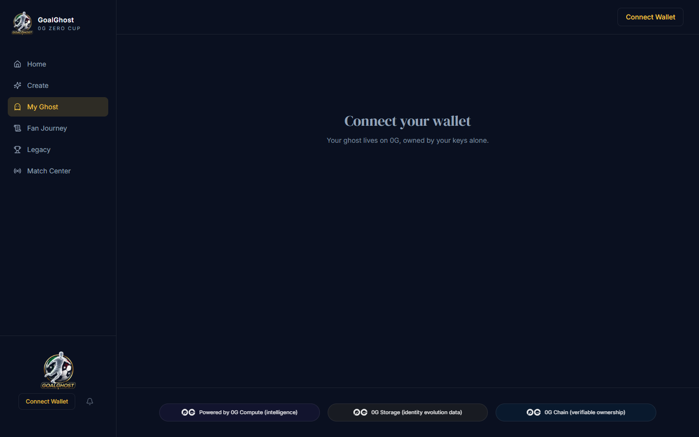
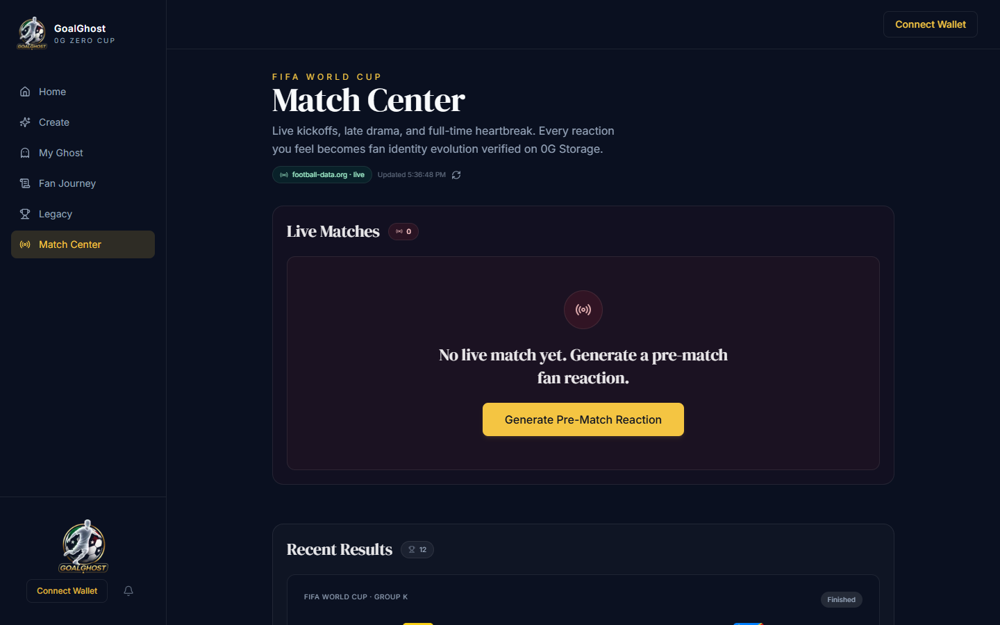
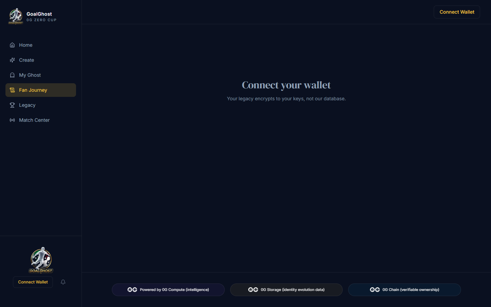

<p align="center">
  
</p>

<h1 align="center">GoalGhost</h1>

<p align="center">
  <strong>A living AI football identity platform built on 0G.</strong><br />
  Evolving fan identities. Permanent memories. A Spotify Wrapped-style football legacy.
</p>

<p align="center">
  <a href="https://goalghost.vercel.app"></a>
</p>

<p align="center">
  
  
  
  
  
</p>

<p align="center">
  <a href="https://goalghost.vercel.app"><strong>Live Demo</strong></a>
  &nbsp;·&nbsp;
  <a href="#judge-walkthrough"><strong>Demo Video / Walkthrough</strong></a>
  &nbsp;·&nbsp;
  <a href="https://github.com/ScavenGem/GoalGhost"><strong>GitHub</strong></a>
  &nbsp;·&nbsp;
  <a href="https://0g.ai"><strong>0G Zero Cup</strong></a>
</p>

<p align="center">
  <sub>Last verified: <strong>June 24, 2026</strong> · Production: <a href="https://goalghost.vercel.app">goalghost.vercel.app</a></sub>
</p>

---

## Overview

**GoalGhost** turns World Cup fandom into a **persistent, evolving AI football identity**.

Fans connect a wallet, birth a GoalGhost, react across the tournament, and close with a **cinematic Legacy Wrapped** — an emotional, shareable summary of their journey. Every identity, memory, comment, and legacy document is anchored to the **full 0G stack**:

| Layer | What GoalGhost uses it for |
|-------|----------------------------|
| **0G Compute** | AI identity generation, match reactions, evolution narratives, Legacy storytelling |
| **0G Storage** | Encrypted profiles, memories, signed comments, media, and Legacy documents |
| **0G Chain** | Wallet signatures, Agentic ID ownership, verifiable identity actions |

PostgreSQL (Neon) indexes content by `rootHash` for fast reads. **0G Storage remains the source of truth.**

---

## Project Status

| Capability | Status |
|------------|--------|
| Wallet Authentication | ✅ |
| GoalGhost Creation | ✅ |
| 0G Compute | ✅ |
| 0G Storage | ✅ |
| 0G Chain | ✅ |
| Match Center | ✅ |
| News Comments | ✅ |
| Legacy Comments | ✅ |
| Fan Journey | ✅ |
| Legacy Wrapped | ✅ |
| Production Deployment | ✅ |

---

## Why GoalGhost

Football platforms capture likes and stats. They do not preserve a fan's **evolving identity** across a tournament.

GoalGhost could only be built with the **full 0G stack**:

| Without 0G Compute | Without 0G Storage | Without 0G Chain |
|--------------------|--------------------|------------------|
| No living AI identity | No permanent fan memories | No verifiable ownership |
| No match reactions or evolution | Comments and media vanish on refresh | Anyone could fake a fan story |
| No Legacy narrative | Centralized cache that forgets | No wallet-signed proof |

Remove any one layer and the core experience breaks. Every major surface shows **"0G does irreplaceable work here"** with Compute, Storage, and Chain badges.

---

## Technical Highlights

| Area | Implementation |
|------|----------------|
| **AI identity generation** | `POST /api/compute/create-ghost` — name, traits, mood, and conviction from 0G Compute |
| **Permanent storage** | Browser ECIES seal for profiles; content-addressed roots on 0G Storage |
| **Wallet-signed interactions** | News and Legacy comments signed by the connected wallet before upload |
| **Evolution engine** | Match reactions and emoji activity update mood, confidence, and Fan Journey memories |
| **Legacy generation** | `POST /api/compute/legacy` produces a Wrapped-style narrative, sealed and presented in a cinematic Spirit ceremony |

---

## Architecture



| Component | Role |
|-----------|------|
| **Wallet** | RainbowKit + Wagmi on 0G Aristotle (chain `16661`); signs comments and mints Agentic ID |
| **0G Compute** | Live inference when `OG_COMPUTE_MODE=live`; powers create, match-reaction, evolve, legacy |
| **0G Storage** | ECIES-encrypted profiles from wallet; public uploads for signed social content |
| **0G Chain** | `iMint` on Agentic ID contract; storage roots anchored to wallet-owned identity |
| **Neon** | Postgres cache for ghosts, comments, reactions — not the canonical data store |
| **Vercel** | Production hosting at [goalghost.vercel.app](https://goalghost.vercel.app) |

**Compute API routes:** `POST /api/compute/create-ghost` · `match-reaction` · `evolve` · `legacy`

---

## Judge Walkthrough

> **Demo video:** Follow the steps below on the **[live demo](https://goalghost.vercel.app)** — the production deployment is the authoritative walkthrough (≈5 minutes).

Follow this path on the live deployment:

| Step | Action | Route | What to verify |
|------|--------|-------|----------------|
| 1 | **Connect wallet** | Any page | RainbowKit connects to 0G Aristotle mainnet |
| 2 | **Create GoalGhost** | `/create` | Choose nation + personality; 0G Compute generates identity |
| 3 | **Generate with 0G Compute** | `/create` | AI name, traits, mood, and conviction returned |
| 4 | **Sign & seal** | `/create` | Wallet seals ECIES profile to 0G Storage |
| 5 | **Seal to 0G Storage** | `/create` | Copy `rootHash` → confirm on [storagescan.0g.ai](https://storagescan.0g.ai) |
| 6 | **Mint on 0G Chain** | `/create` | Agentic ID minted; token linked to storage root |
| 7 | **Explore Fan Journey** | `/memories` | Chronological timeline with Storage verification links |
| 8 | **My Ghost** | `/ghost` | Evolution score, mood, and **Evolve Narrative** via 0G Compute |
| 9 | **Match Center** | `/matches` | Live match feed, emoji reactions, Compute match reactions |
| 10 | **News comments** | `/` | World Cup news wall — wallet-signed comments with image/GIF attachments |
| 11 | **Legacy comments** | `/legacy` | Public comments wall below the Legacy ceremony |
| 12 | **Unwrap Legacy** | `/legacy` | Cinematic Spirit ceremony → share, seal, download, replay |

**Resilience check:** Postgres is a cache. Ghost profiles resolve from 0G Storage `rootHash` even if the index is rebuilt.

### 0G Aristotle Mainnet

| Setting | Value |
|---------|-------|
| Chain ID | `16661` |
| RPC | `https://evmrpc.0g.ai` |
| Chain explorer | [chainscan.0g.ai](https://chainscan.0g.ai) |
| Storage indexer | `https://indexer-storage-turbo.0g.ai` |
| Storage explorer | [storagescan.0g.ai](https://storagescan.0g.ai) |

---

## Features

Everything listed below is implemented in this repository.

- **Wallet authentication** — RainbowKit + Wagmi on 0G Aristotle mainnet
- **GoalGhost creation** — Nation, personality, birth ritual, AI-generated identity
- **0G Compute** — Create, match reactions, evolve narrative, Legacy generation
- **0G Storage** — ECIES profile seal, memories, signed comments, Legacy documents
- **0G Chain** — Agentic ID `iMint`, wallet-signed comment payloads
- **My Ghost** — Live stats, evolution arc, on-demand narrative evolution
- **Match Center** — Live/upcoming/finished matches, emoji reactions, Compute reactions
- **World Cup news** — Headlines on Home with wallet-signed comments and media attachments
- **Fan Journey** — Memory timeline with type labels and Storage scan links
- **Legacy Wrapped** — Cinematic Spirit ceremony with share, seal, download, and replay
- **Legacy comments** — Wallet-signed public wall on `/legacy`
- **0G irreplaceable banners** — Compute / Storage / Chain callouts on key surfaces

---

## Screenshots

Captured from production at `1440×900`. Regenerate with `node scripts/capture-readme-screenshots.mjs`.

<p align="center">
  
  
</p>

<p align="center">
  
  
</p>

<p align="center">
  
  
</p>

| Page | Route | Screenshot |
|------|-------|------------|
| Home | `/` | `docs/screenshots/home.png` |
| Create | `/create` | `docs/screenshots/create.png` |
| My Ghost | `/ghost` | `docs/screenshots/my-ghost.png` |
| Match Center | `/matches` | `docs/screenshots/match-center.png` |
| Fan Journey | `/memories` | `docs/screenshots/fan-journey.png` |
| Legacy | `/legacy` | `docs/screenshots/legacy.png` |

---

## Tech Stack

| Category | Technology |
|----------|------------|
| Framework | Next.js 15 (App Router), TypeScript, React 19 |
| UI | Tailwind CSS v4, Framer Motion, Radix UI |
| Wallet | RainbowKit, Wagmi, ethers.js, viem |
| Database | Prisma + Neon PostgreSQL (index cache) |
| 0G | `@0gfoundation/0g-compute-ts-sdk`, `@0gfoundation/0g-storage-ts-sdk` |
| Chain | 0G Aristotle mainnet (`16661`) |
| Deploy | Vercel |

---

## Quick Start

```bash
git clone https://github.com/ScavenGem/GoalGhost.git
cd GoalGhost
npm install
cp .env.example .env.local
npx prisma db push
npm run build
npm run dev
```

Open **http://localhost:3000**

### Key environment variables

| Variable | Purpose |
|----------|---------|
| `NEXT_PUBLIC_WALLETCONNECT_PROJECT_ID` | RainbowKit wallet modal |
| `DATABASE_URL` / `DIRECT_URL` | Neon Postgres index cache |
| `OG_COMPUTE_MODE` | Set to `live` for real 0G Compute inference |
| `OG_COMPUTE_PRIVATE_KEY` | Server compute wallet (live mode) |
| `OG_STORAGE_PRIVATE_KEY` | Server uploads for signed comment media |
| `NEXT_PUBLIC_AGENTIC_ID_CONTRACT` | Deployed Agentic ID contract address |
| `NEXT_PUBLIC_NEWS_API_KEY` | World Cup news feed (optional) |
| `FOOTBALL_DATA_API_KEY` / `API_FOOTBALL_KEY` | Live match data (optional) |

```bash
npm run build    # production verify
npm run dev      # local development
npm run compute:init  # initialize 0G Compute ledger (live mode)
```

---

<p align="center">
  <strong>GoalGhost</strong> · The tournament remembers you.<br />
  <sub>0G Zero Cup · June 2026 · <a href="https://goalghost.vercel.app">goalghost.vercel.app</a></sub>
</p>